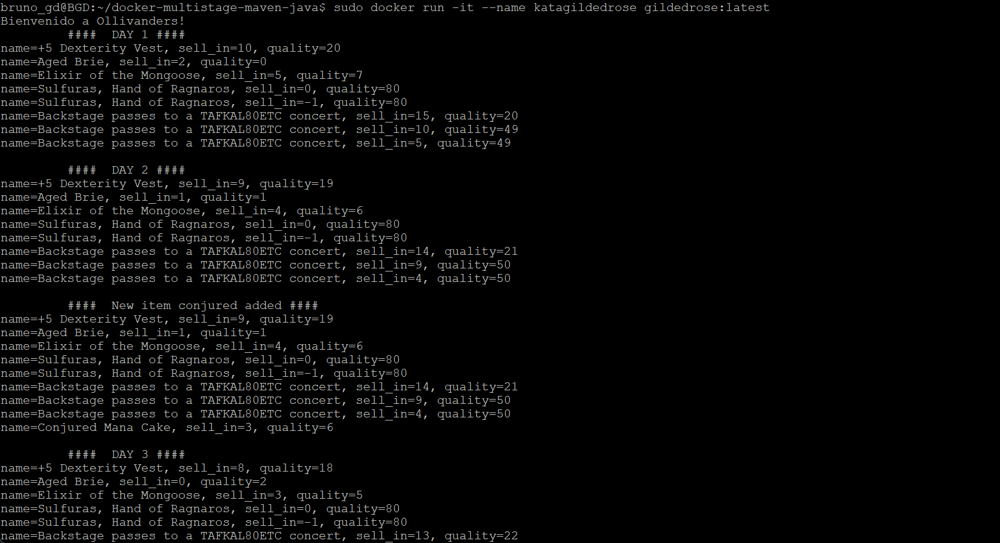

<!-- 1- Crear una VM -->
## Crear una VM en Azure Cloud
###### Requisito previo, tener cuenta en Microsoft Azure
1. Acceder a la web de Azure (panel de control)
2. Crear una nueva Máquina virtual

3. Rellenar los campos obligatorios para la creación de una VM

<!-- 2- Conectarse a ella -->
## Conectarse a nuestra VM de Azure Cloud

4. Visualizar la información de la VM para poder conectarnos

5. Copiar la IP pública de nuestra máquina para poder conectarnos a través de SSH
6. Acceder a nuestro CLI para conectarnos con SSH _(en mi caso usaré PuTTY)_
7. Conectarse a la máquina con nuestro usuario y contraseña

<!-- 3- Instalar la paquetería necesaria en la VM -->
## Actualizar la lista de paquetes
8. Ejecutar los comandos `$ apt update | apt upgrade`  <small>en caso de error usar `sudo`</small>

<!-- 4- Instalar git -->
## Instalación de paquetería necesaria
9. Instalar `git` con `$ sudo apt install git`

<!-- 5 - Instalar Docker (nivel ninja utilizando el script de bash obtenido de get-docker.com) -->
10. Instalar `docker` y `docker.io` con `$ sudo apt install docker.io`

###### Comprobación de git y docker instalados

<!-- 6 - Repetir los pasos de la en entrega del Gilded Rose dockerizada -->
## Crear contenedor de Docker y ejecutar el proyecto Maven
11. Clonar el repositorio con el proyecto Maven

12. Crear el contenedor con `docker build`

13. Ejecutar el contenedor con `docker run`

